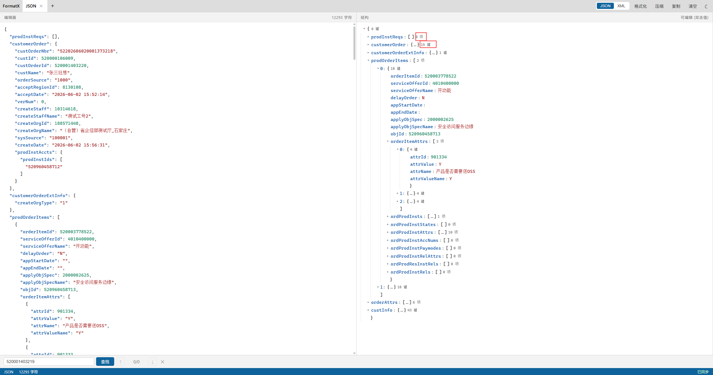

# FormatX

离线 Windows JSON/XML 格式化工具。支持格式化、压缩、复制、明暗主题、左侧编辑器与右侧结构树同步。



## 功能

- JSON、XML 格式化与压缩
- 单一编辑器，处理结果原地替换
- JSON 树展开与键/值编辑同步
- 结构树折叠时显示键/项数量，展开后保持阅读清爽
- 深色、明亮、跟随系统主题
- 本地运行，不上传文本

## 开发

```powershell
npm.cmd install
npm.cmd test -- --run
npm.cmd run tauri dev
```

## 构建 Windows 发布包

```powershell
npm.cmd run build:release
```

产物位于 `src-tauri/target/release/bundle/`：

- `nsis/`：轻量 EXE 安装包，适合个人安装。
- `msi/`：中文 Windows Installer 包，适合企业软件分发、静默安装和统一管理。
- `FormatX-portable.zip`：便携版；解压后直接运行 `FormatX-portable/FormatX.exe`，不创建卸载项或修改 PATH。

便携版与安装版都需要目标 Windows 已安装 Microsoft Edge WebView2 Runtime。

## 版本 0.2.0

- 修复 JSON 编辑器粘贴后出现高亮标记的问题。
- 优化结构树的箭头、字段对齐、层级缩进和展开/折叠提示。
- 更新 FormatX 图标，并同步至应用、安装包和便携版。
- 提供中文 MSI 与免安装便携 ZIP。
